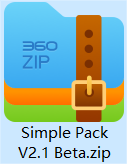

## 安装教程
一般来说，下载后我们会得到一个压缩包文件，就像这样：  
  
随后，不要解压！不要解压！不要解压！重要的事情说三遍。  
我们将该文件拖入任意一个主流第三方启动器，例如PCL、HMCL等等即可自动安装！

## 重要的按键配置
```
#5 更新了 Tweakeroo 模组的配置，现在按下 U 键可以开启夜视，按下 \ 键可以进行灵魂出窍  
#9 在背包或箱子内按下 R 键即可一键整理（其实这个功能早就有了）  
#10 按下 G 键打开路径点设置，按下 B 键新建一个路径点，按下 N 键打开大地图  
#11 在背包或箱子内将准星对准一个潜影盒按下 Shift 键即可查看详细内容  
#13 增加了 Litematica 投影模组优化生存体验，按下 M 键打开投影菜单  
```
*摘自更新日志*

## 注意事项
1. 本整合包更新了 MCBBS v2通用格式 拖动该压缩文件至任意第三方启动器主界面即可加载  
2. 强烈建议开启全部版本隔离  
3. 整合包会添加一些辅助功能，请仔细查阅，例如按下 U 键可以开启夜视...  

## 更新方法  
1. 若开启了版本隔离，删除原整合包目录文件，重新拖入启动器安装即可  
2. 记得备份存档并后续替换 ../minecraft/saves  
3. 有一定操作能力的玩家可备份已个性化配置的相关模组配置文件再替换

## 版本对应
```
#整合包版本...
#游戏版本...
 
*Optimized V1.0 Alpha
*使用的是 1.20.1 游戏版本，装载Fabric 0.14.22，FabricAPI 0.87.0
 
*Optimized V1.1 Alpha
*使用的是 1.20.1 游戏版本，装载Fabric 0.14.22，FabricAPI 0.87.0
 
*Lazyboy Pack V2.0 Alpha
*使用的是 1.20.1 游戏版本，装载Fabric 0.14.22，FabricAPI 0.87.0
 
*Simple Pack V2.1 Beta
*使用的是 1.20.1 游戏版本，装载Fabric 0.15.7，FabricAPI 0.92.0+
 
*Simple Pack V2.2 Beta
*使用的是 1.21.1 游戏版本，装载Fabric 0.18.4，FabricAPI 0.116.8+
```

## 更多的相关帮助和支持
> 聊天x吹水x解惑x反馈整合包问题x意见提出，欢迎加入QQ群894624441。